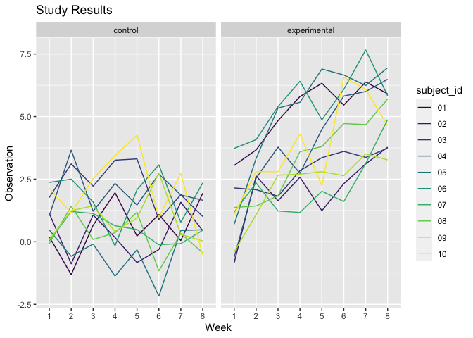
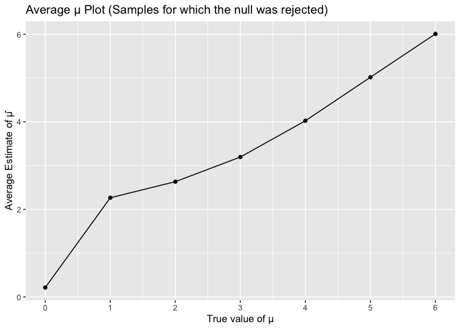

Homework 5
================
Selina Hsuan
2023-11-15

## Problem 1

``` r
library(tidyverse)
library(p8105.datasets)
```

Download and clean data

``` r
homicides_df = 
  read_csv("data/homicide-data.csv", na = c("", "NA", "Unknown")) |> 
  janitor::clean_names() |> 
  mutate(
    city_state = str_c(city, state, sep = ", "),
    resolution = case_when(
      disposition == "Closed without arrest" ~ "unsolved",
      disposition == "Open/No arrest"        ~ "unsolved",
      disposition == "Closed by arrest"      ~ "solved"
    )
  ) |> 
    filter(city_state != "Tulsa, AL") 
```

Homicides solved by city_state

``` r
city_homicide_df = 
  homicides_df |> 
  select(city_state, disposition, resolution) |> 
  group_by(city_state) |> 
  summarize(
    hom_total = n(),
    hom_unsolved = sum(resolution == "unsolved"))
```

Proportion of homicides unsolved in Baltimore, MD

``` r
bmore_test = 
  prop.test(
    x = filter(city_homicide_df, city_state == "Baltimore, MD") |>  pull(hom_unsolved),
    n = filter(city_homicide_df, city_state == "Baltimore, MD") |>  pull(hom_total)) 

broom::tidy(bmore_test) |> 
  knitr::kable(digits = 3)
```

| estimate | statistic | p.value | parameter | conf.low | conf.high | method                                               | alternative |
|---------:|----------:|--------:|----------:|---------:|----------:|:-----------------------------------------------------|:------------|
|    0.646 |   239.011 |       0 |         1 |    0.628 |     0.663 | 1-sample proportions test with continuity correction | two.sided   |

Estimates and CI’s for proportion of unsolved homicides in each city

``` r
test_results = 
  city_homicide_df |> 
  mutate(
    prop_tests = map2(hom_unsolved, hom_total, \(x, y) prop.test(x = x, n = y)),
    tidy_tests = map(prop_tests, broom::tidy)) |> 
    select(-prop_tests) |> 
    unnest(tidy_tests) |> 
    select(city_state, estimate, conf.low, conf.high) |> 
    mutate(city_state = fct_reorder(city_state, estimate))
```

Create plot showing the estimate (and CI) of the proportion of unsolved
homicides in each city

``` r
test_results |> 
  mutate(city_state = fct_reorder(city_state, estimate)) |> 
  ggplot(aes(x = city_state, y = estimate)) + 
  geom_point() + 
  geom_errorbar(aes(ymin = conf.low, ymax = conf.high)) + 
  theme(axis.text.x = element_text(angle = 90, hjust = 1))
```

<!-- -->

## Problem 2

First, we create a dataframe containing all file names.

``` r
list_participant = 
  setdiff(list.files("data"), "homicide-data.csv")
```

Next, we iterate over file names and read in data for each subject.

``` r
read_data = function(file) {
  data = read_csv(paste0("data/", file))
  return(data)
}
```

We save the results as a new variable in participant_df and tidy the
results.

``` r
participant_df = 
  data.frame(file_name = list_participant) |> 
  mutate (data = map(file_name, read_data)) |> 
  unnest(data) |> 
  separate(file_name, into = c("study_arm", "subject_id"), sep = "_") |> 
  pivot_longer(week_1:week_8,
    names_to = "week", 
    values_to = "observation") |> 
  mutate(subject_id = str_replace(subject_id, ".csv", ""),
         week = str_replace(week, "week_", ""), 
         study_arm = case_when(
           study_arm == "con" ~ "control",
           study_arm == "exp" ~ "experimental"
         )) 
```

Finally, we make a spaghetti plot.

``` r
participant_df |> 
  ggplot(aes(x = week, y = observation, color = subject_id, group = subject_id)) + 
  facet_grid(~study_arm) +
  geom_line(aes(color = subject_id)) +
  labs(title = "Study Results", 
        x = "Week",
        y = "Observation") +
  viridis::scale_color_viridis(discrete = TRUE)
```

<!-- -->

The spaghetti plot shows that longitudinal observations from Week 1 to
Week 8 have higher values overall in the experimental arm compared to
the control arm. There appears to be an upward trend in observation
values for the experimental arm, while observation values for the
control arm fluctuate around the same range.

## Problem 3

First, we set seed for reproducibility.

``` r
set.seed(12345)
```

Next, we set up the design elements.

``` r
sim_function = function(n_obs=30, mu, sigma = 5) {
  
  data = tibble(
    x = rnorm(n = n_obs, mean = mu, sd = sigma)
  )
  
  output = data |> 
    t.test(mu=0) |> 
    broom::tidy() |>
    select(estimate, p.value) |>
    rename(est = estimate, p_val = p.value)
}
```

Now, we generate 5000 datasets from the model for seven different values
of mu.

``` r
sim_result_df =
  expand_grid(
    mu = c(0, 1, 2, 3, 4, 5, 6),
    iter = 1:5000
  ) |> 
  mutate(estimate_df = map(mu, ~sim_function(mu=.x))) |> 
  unnest(estimate_df) |> 
  mutate (conclusion = case_when (
      p_val < 0.05 ~ "reject null",
      p_val >= 0.05 ~ "fail to reject null"))
```

Using the generated data, we make a plot showing the proportion of times
the null was rejected against the true value of mu.

``` r
sim_result_df |> 
  group_by(mu) |> 
  summarise(power = sum(conclusion == "reject null") / n()) |> 
  ggplot(aes(x = mu, y = power)) +
  geom_line() +
  geom_point() + 
  scale_x_continuous(breaks = seq(0, 6, 1)) +
  labs(
    title = "Power Plot",
    x = "True Value of μ",
    y = "Power", 
  ) 
```

<!-- -->
The plot shows that as the true value of mu increases, the power (or
proportion of times the null was rejected) also increases. This makes
sense because because as the true value of mu gets farther away from 0,
the null hypothesis of H:μ=0 is more and more likely to be rejected. In
other words, a greater proportion of estimates from the random sample
are significantly different from 0. According to the plot, when the true
value of mu is 5 and 6, the null is rejected for all estimates.

Now, we make a plot showing the average estimate of mu against the true
value of mu.

``` r
sim_result_df |> 
  group_by(mu) |> 
  summarise(mean_mu = mean(est)) |>
  ggplot(aes(x = mu, y = mean_mu)) +
  geom_line() +
  geom_point() +
  scale_x_continuous(breaks = seq(0, 6, 1)) +
  labs(
    title = "Average μ Plot",
    x = "True value of μ",
    y = "Average Estimate of μ̂"
  ) 
```

<!-- -->

We make a similar plot showing the average estimate of mu only in
samples for which the null was rejected against the true value of mu.

``` r
sim_result_df |> 
  filter(conclusion == "reject null") |> 
  group_by(mu) |> 
  summarise(mean_mu = mean(est)) |> 
  ggplot(aes(x = mu, y = mean_mu)) +
  geom_line() +
  geom_point() +
  scale_x_continuous(breaks = seq(0, 6, 1)) +
  labs(
    title = "Average μ Plot (Samples for which the null was rejected)",
    x = "True value of μ",
    y = "Average Estimate of μ̂"
  ) 
```

<!-- -->

Based on the two plots above, when the true value of mu is 0-4, the
average estimate of mu across tests for which the null is rejected is
greater than the true value of mu. When the true value of mu reaches 5
and 6, the average estimate of mu is equal to the true value of mu. The
average estimate deviates the greatest from the true value when the true
value equals 1. This is because the closer the true mu is to 0, the
greater the proportion of estimates that will be deemed significantly
similar to 0. Thus, the estimates that are not significant (null is
rejected) will skew on the higher end of the distribution of estimates
of the true mu. As the true mu increases, an increasingly smaller
proportion of estimates are deemed significantly similar to 0. Thus,
when the true mu reaches 5 and 6, the average estimate of mu is equal to
the true value of mu.
